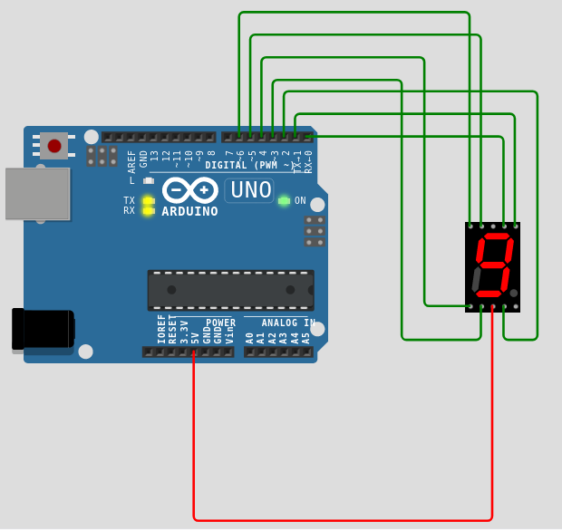

# Relatório da Atividade 2

## Exercício 1

Este exercício consiste simplesmente em um arduino UNO com 2 LEDs e dois botões, o *top button* e o *bottom button*, como são chamados no código do [exercício no wokwi](https://wokwi.com/projects/394438792120935425). O arduino controla os dois leds da seguinte forma: Os dois botões são usados em modo PULL UP, o que significa que, caso pressionados, o sinal que chega para as entradas dos ledes é zero, caso eles sejam apertados. Enquanto o *botton button* é pressionado, on LED vermelho ascende, já enquanto o *top button é pressionado*, os dois leds ficam piscando alternadamente.

A imagem a seguir mostra o circúito feito no simulador. A saida **1.l** do *top button* é ligada na **entrada digital 5** do Arduino UNO, a saida **1.l** do *botton button*, na **entrada digital 4**. Já as saídas **2.r** dos dois botões são ligadas ao ***Ground***, ou seja, recebem o **sinal lógico 0**.
As LEDs, por sua vez, tem seus catpodos ligados ao *Ground*, o anodo do LED vermelho é conectado à **entrada 6**, e o do verde, **à entrada 7**.


A próxima omagem mostra o código propriamente dito. Nele, são dados nomes característicos para as entradas digitais, de acordo com os dispositivos ligados nelas. Os botões são setados como **inputs do tipo pull up**, e os LEDs, como **outputs**. Inicialmente, os LEDs estão apagados. Quando o *top button* é pressionado, o nível lógico da porta 5 é lido zero, e a porta 6, da LED vermelha, é setado como *HIGHT*, o que faz a luz vermelha ascender. Se o *bottom button* é pressionado, a porta 6 fica em nível alto por 300 ms, depois a porta 7, e as duas ficam se alternando. Caso nenhum dos botões esteja ativado, ambas as LEDs se apagam. 

```cpp
  int greenLight = 7,redLight = 6, bottonButton = 4, topButton = 5;


void setup() {
  pinMode(greenLight, OUTPUT);
  pinMode(redLight, OUTPUT);
  pinMode(bottonButton, INPUT_PULLUP);
  pinMode(topButton, INPUT_PULLUP);

}

void loop() {
  while (digitalRead(topButton) == LOW){
    digitalWrite(redLight, HIGH);
  }
  while(digitalRead(bottonButton) == LOW){
  
    digitalWrite(redLight, HIGH);
    delay(300);
    digitalWrite(redLight, LOW);

    digitalWrite(greenLight, HIGH);
    delay(300);
    digitalWrite(greenLight, LOW);
   
  }

  while(digitalRead(topButton) == HIGH && digitalRead(bottonButton) == HIGH){
    digitalWrite(redLight, LOW);
    digitalWrite(greenLight, LOW);
  }

}


```
## Execício 2

Este [exercício](https://wokwi.com/projects/394445390046628865) consiste em escrever *Hello World* em um display, usando o Arduino UNO.
Para isso, foi utilizado o *wokwi-lcd2004*. O pino *VCC* do display foi ligado na fonte de 5V do arduino, o *Ground* do display foi ligado ao *Ground* do UNO, e seus pinos SDA e SCL foram ligados, respectivamente, às entradas A4 e A5 do arduino. A imagem abaixo mostra o simulador funcionando.


Quanto ao código, foi utilizada a biblioteca ***LiquidCrystal_I2C.h***, para se criar um objeto **lcd**, ligar a luz de fundo do *display*, meramente por aparência, depois, a função **print**, do objeto **lcd**, é usada para printar, na tela do *display*, a frase *Helo World*.


```cpp
#include <LiquidCrystal_I2C.h>

#define LCD_ADDR 0x27
#define LCD_COLUMNS 16
#define LCD_ROWS 2

LiquidCrystal_I2C lcd(LCD_ADDR,LCD_COLUMNS,LCD_ROWS);


void setup() {
  // put your setup code here, to run once:
  lcd.begin(16,2);
  lcd.init();
  lcd.backlight();
  lcd.setCursor(5,0);
  lcd.print("Hello World");
}

void loop() {
  // put your main code here, to run repeatedly:

}

```

## Exercício 3

Para este [exercício](https://wokwi.com/projects/394444628106182657), os pinos o a 7 do arduino UNO foram ligados aos pinos do display de 7 seguimentos, correspondentes aos segumentos de a a g, respectivamente. O segmento também foi ligado à fonte de tensão de 5V do arduino, para que pudesse funcionar. A figura a seguir mostra o circuito.



O código do exercício, mostrado a seguir, consiste em setar os pinos de 0 a 6 como as variáveis do tipo OUTPUT a a g. Depois é criada a função *nine()*, responsável por setar os níveis lógicos das variáveis de modo que o display mostre o número 9.

```cpp

int a=0,b=1,c=2,d=3,e=4,f=5,g=6;

void setup() {
  pinMode(a , OUTPUT);
  pinMode(b , OUTPUT);
  pinMode(c , OUTPUT);
  pinMode(d , OUTPUT);
  pinMode(e , OUTPUT);
  pinMode(f , OUTPUT);
  pinMode(g , OUTPUT);

}

void nine(){
  digitalWrite(a, LOW);
  digitalWrite(b, LOW);
  digitalWrite(c, LOW);
  digitalWrite(d, LOW);
  digitalWrite(e, HIGH);
  digitalWrite(f, LOW);
  digitalWrite(g, LOW);
}

void loop() {
  nine();
}

```

## Exercício 4

Este [exercício](https://wokwi.com/projects/394449591727510529) consiste em um aprimoramento do exercício anterior. A diferença, no circuito é o acrescimo de 2 botões, o *top buttom* e o *bottom button* . Ambos tem sua entrada **1.r** ligada ao *Ground*. Suas entradas **2.l** estão ligadas, respectivamente aos pinos 10 e 11 do arduino UNO.  


Quanto ao código, além das variáveis a a g,são criadas as variáveis *upButton* e *dowButton*, que representão os pinos 10 e 11, respectivamente. Essas variáveis são setadas como inputs do tipo **PULL UP**. Além disso, são criadas funções para fazer o display mostrar todos os números de 1 a 9. Também são criadas as variáveis *currentNumber*,*maxNumber* e *minNumber*, que são usadas para se programar o circuito de modo que o botão de cima, caso pressionado, incremente o número mostrado, e o botão de baixo o decremente.

Na função *loop()*, se o botão de cima for pressionado, o sinal lógico de *upButton* é lido como zero, e o valor de *currentNumber* é incrementado. Caso este valor seja maior que 9, ele passa a ser 9; caso o valor seja menor  que zero, ele volta a ser 0. O delay no código é pr evitar que uma pressionada rápida no botão leve a mudnças rápidas demais para o olho humano acompanhar.

```cpp
int a=0,b=1,c=2,d=3,e=4,f=5,g=6,upButton=10,dowButton=11;

int currentNumber = 0; // Start with number 1
const int maxNumber = 9; // Maximum number to display
const int minNumber = 0; // Minimum number to display

void setup() {
  pinMode(a , OUTPUT);
  pinMode(b , OUTPUT);
  pinMode(c , OUTPUT);
  pinMode(d , OUTPUT);
  pinMode(e , OUTPUT);
  pinMode(f , OUTPUT);
  pinMode(g , OUTPUT);
  pinMode(upButton, INPUT_PULLUP);
  pinMode(dowButton, INPUT_PULLUP);

}

void zero(){
  digitalWrite(a, LOW);
  digitalWrite(b, LOW);
  digitalWrite(c, LOW);
  digitalWrite(d, LOW);
  digitalWrite(e, LOW);
  digitalWrite(f, LOW);
  digitalWrite(g, HIGH);
}

void one(){
  digitalWrite(a, HIGH);
  digitalWrite(b, LOW);
  digitalWrite(c, LOW);
  digitalWrite(d, HIGH);
  digitalWrite(e, HIGH);
  digitalWrite(f, HIGH);
  digitalWrite(g, HIGH);
}

void two(){
  digitalWrite(a, LOW);
  digitalWrite(b, LOW);
  digitalWrite(c, HIGH);
  digitalWrite(d, LOW);
  digitalWrite(e, LOW);
  digitalWrite(f, HIGH);
  digitalWrite(g, LOW);
}

void three(){
  digitalWrite(a, LOW);
  digitalWrite(b, LOW);
  digitalWrite(c, LOW);
  digitalWrite(d, LOW);
  digitalWrite(e, HIGH);
  digitalWrite(f, HIGH);
  digitalWrite(g, LOW);
}

void four(){
  digitalWrite(a, HIGH);
  digitalWrite(b, LOW);
  digitalWrite(c, LOW);
  digitalWrite(d, HIGH);
  digitalWrite(e, HIGH);
  digitalWrite(f, LOW);
  digitalWrite(g, LOW);
}

void five(){
  digitalWrite(a, LOW);
  digitalWrite(b, HIGH);
  digitalWrite(c, LOW);
  digitalWrite(d, LOW);
  digitalWrite(e, HIGH);
  digitalWrite(f, LOW);
  digitalWrite(g, LOW);
}

void six(){
  digitalWrite(a, LOW);
  digitalWrite(b, HIGH);
  digitalWrite(c, LOW);
  digitalWrite(d, LOW);
  digitalWrite(e, LOW);
  digitalWrite(f, LOW);
  digitalWrite(g, LOW);
}

void seven(){
  digitalWrite(a, LOW);
  digitalWrite(b, LOW);
  digitalWrite(c, LOW);
  digitalWrite(d, HIGH);
  digitalWrite(e, HIGH);
  digitalWrite(f, HIGH);
  digitalWrite(g, HIGH);
}

void eight(){
  digitalWrite(a, LOW);
  digitalWrite(b, LOW);
  digitalWrite(c, LOW);
  digitalWrite(d, LOW);
  digitalWrite(e, LOW);
  digitalWrite(f, LOW);
  digitalWrite(g, LOW);
}

void nine(){
  digitalWrite(a, LOW);
  digitalWrite(b, LOW);
  digitalWrite(c, LOW);
  digitalWrite(d, LOW);
  digitalWrite(e, HIGH);
  digitalWrite(f, LOW);
  digitalWrite(g, LOW);
}

void loop() {
  
  if (!digitalRead(upButton)) { 
    currentNumber++;
    if (currentNumber > maxNumber) {
      currentNumber = maxNumber;
    }
    delay(250); 
  }

  if (!digitalRead(dowButton)) { 
    currentNumber--;
    if (currentNumber < minNumber) {
      currentNumber = minNumber;
    }
    delay(250); 
  }

  
  switch (currentNumber) {

    case 0:
      zero();
    break;

    case 1:
      one();
    break;

    case 2:
      two();
    break;

    case 3:
      three();
    break;

    case 4:
      four();
    break;
    
    case 5:
      five();
    break;

    case 6:
      six();
    break;
    
    case 7:
      seven();
    break;

    case 8:
      eight();
    break;

    case 9:
      nine();
    break;

    default:
      
    break;
  }


}

```


